# Hướng dẫn sử dụng - Sổ Chủ Nhiệm Số

Phiên bản: 1.0 · Ngày: 21/09/2026
Địa chỉ hệ thống: https://so-chu-nhiem-so-theta.vercel.app

Tài liệu này hướng dẫn thao tác theo từng vai trò, kèm ảnh màn hình chụp trực tiếp từ hệ thống. Xem thêm `MO-TA-CHUC-NANG.md` để biết mô tả chi tiết từng chức năng.

---

## 1. Đăng nhập

Truy cập địa chỉ hệ thống → nhập **Tên đăng nhập** + **Mật khẩu** → **Đăng nhập**.

Môi trường demo có sẵn danh sách vai trò trong ô "Đăng nhập với vai trò (demo)" - chọn vai trò để hệ thống tự điền tài khoản. Mật khẩu demo chung: `demo1234`.

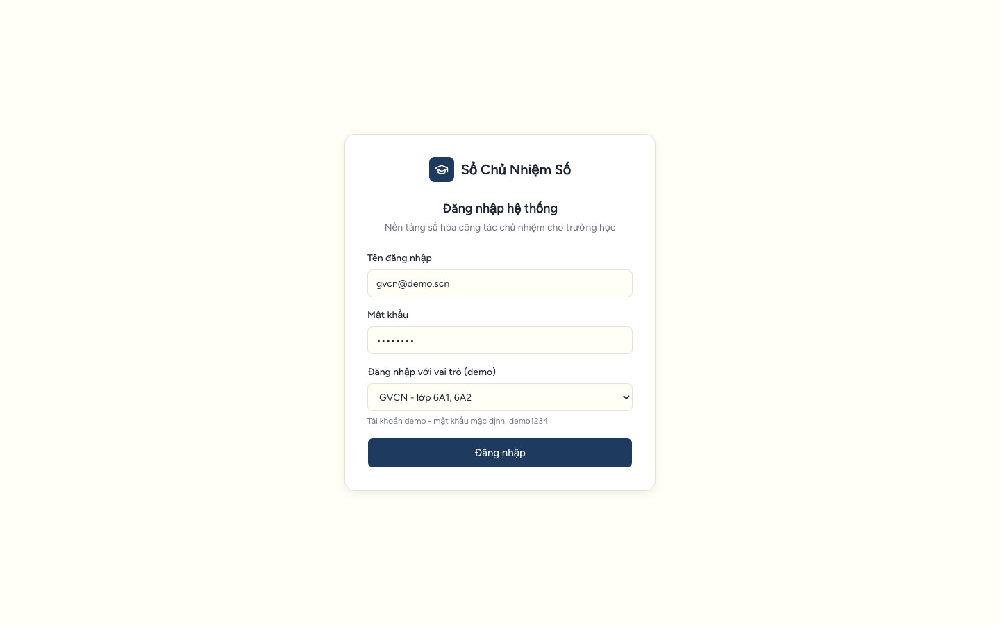

Sau đăng nhập, hệ thống tự chuyển đến trang chủ theo vai trò. Thanh bên trái là menu chức năng được phân quyền riêng cho vai trò của bạn. Góc trên phải: tìm nhanh (Ctrl+K), thông báo, tài khoản, đăng xuất.

---

## 2. Giáo viên chủ nhiệm (GVCN)

GVCN là vai trò trung tâm - quản lý toàn bộ hoạt động của lớp chủ nhiệm.

### 2.1 Dashboard

Trang chủ hiển thị tổng quan lớp: chuyên cần hôm nay (hoặc ngày gần nhất có dữ liệu), sự cố đang mở, việc sắp đến hạn, cảnh báo học sinh.

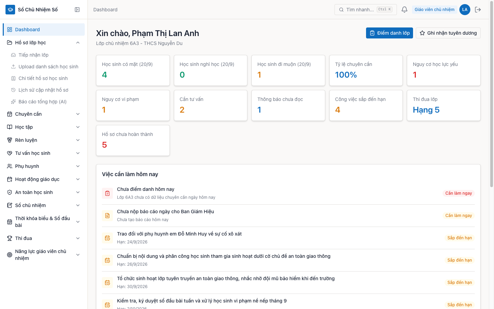

### 2.2 Điểm danh hàng ngày

Menu **Chuyên cần → Điểm danh hàng ngày**.

1. Chọn lớp (nếu chủ nhiệm nhiều lớp).
2. Chọn ngày bằng ô ngày hoặc nút ‹ › để xem/sửa điểm danh ngày cũ - bấm **Xem** để tải dữ liệu ngày đã chọn.
3. Đánh dấu trạng thái từng em: Có mặt / Nghỉ có phép / Nghỉ không phép / Đi muộn.
4. Bấm **Xác nhận chuyên cần** để lưu.

6 thẻ tổng ở trên cập nhật theo ngày đang xem: Sĩ số, Có mặt, Vắng, Nghỉ có phép, Nghỉ không phép, Đi muộn. Nút **Tải template / Import Excel** hỗ trợ nhập điểm danh hàng loạt.

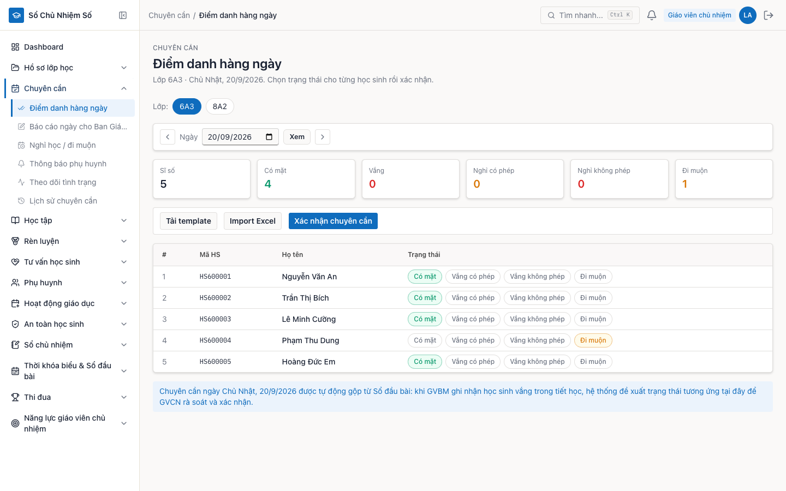

### 2.3 Theo dõi tình trạng & lịch sử chuyên cần

- **Theo dõi tình trạng**: ma trận học sinh × ngày. Chọn ngày mốc ở ô "Đến ngày" để xem chuỗi vắng/muộn gần đó - phát hiện em vắng liên tục.
- **Nghỉ học / đi muộn**: sổ vắng/muộn theo khoảng ngày - chọn **Từ ngày / Đến ngày** rồi xem danh sách kèm lý do, nguồn ghi (GVCN nhập / Sổ đầu bài / Phụ huynh báo).
- **Lịch sử chuyên cần**: chọn khoảng ngày để xem tỷ lệ chuyên cần, biểu đồ, bảng chi tiết.

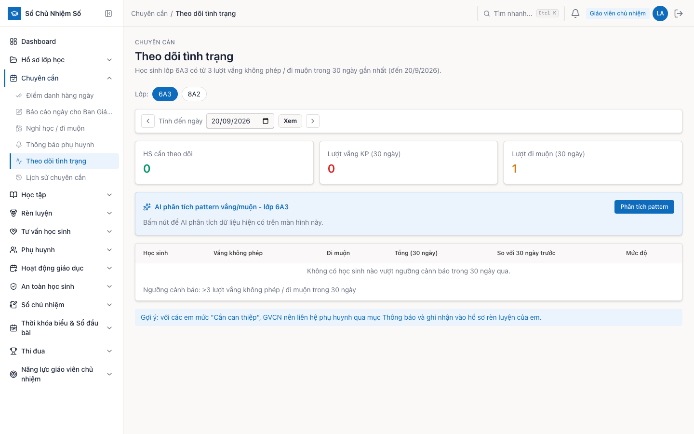
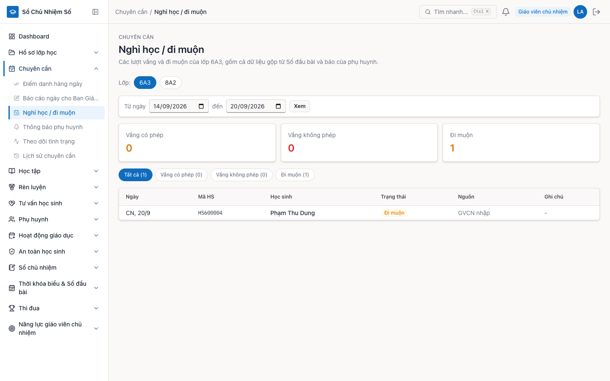
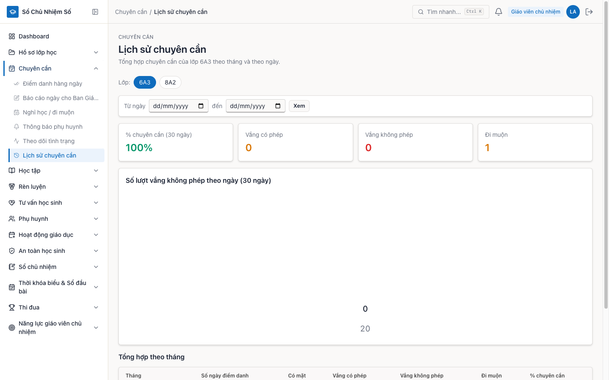

### 2.4 Nhập / đồng bộ điểm (Sổ điểm)

Menu **Học tập → Nhập / đồng bộ điểm**.

1. Chọn **Lớp** + **Môn học** + **Học kỳ** (I/II).
2. Bảng điểm gồm các cột: **Miệng, 15 phút, 1 tiết** (hệ số 1 - số cột tùy ý), **ĐĐGgk** (hệ số 2), **ĐĐGck** (hệ số 3).
3. Thêm cột đánh giá thường xuyên: chọn loại ở ô kế nút **Thêm cột điểm** → bấm để thêm. Xóa cột bằng dấu × trên tiêu đề cột.
4. Nhập điểm từng ô (0-10). Cột **ĐTBm** tự tính theo công thức Thông tư 22: `(Tổng ĐGTX + 2×ĐĐGgk + 3×ĐĐGck) / (số ĐGTX + 5)`.
5. Bấm **Lưu điểm**. Khi tải lại trang, các cột đã lưu tự dựng lại đúng loại.

Nhập hàng loạt: **Tải template** → điền Excel → **Import Excel**. Xuất kết quả: chọn mẫu ở ô "Mẫu 1/2/3" → nút xuất.

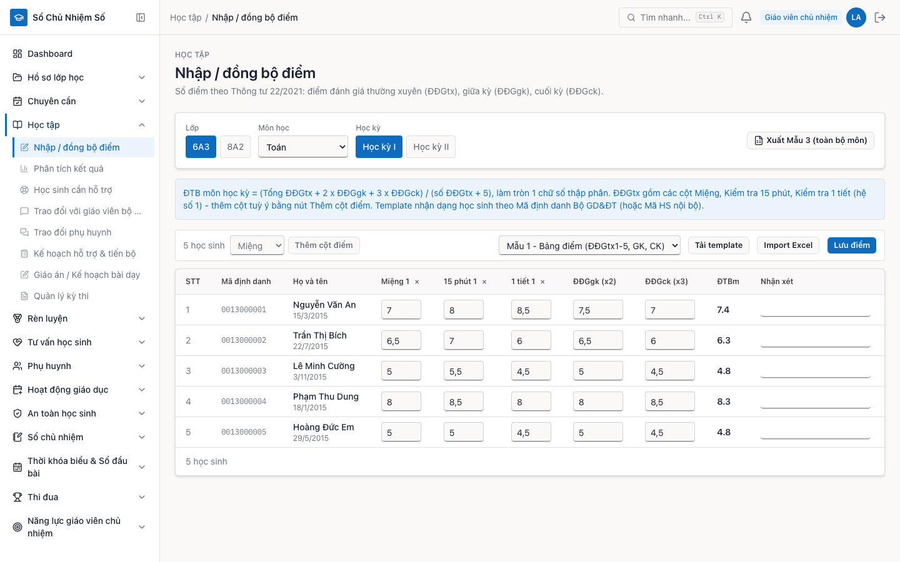

### 2.5 Thời khóa biểu

Menu **Thời khóa biểu & Sổ đầu bài → Thời khóa biểu**. Hai chế độ:

- **Theo lớp** (mặc định): TKB lớp chủ nhiệm của bạn - chip lớp có đánh dấu `(CN)`.
- **Lịch cá nhân**: toàn bộ tiết bạn dạy trong tuần, mỗi ô hiển thị `Lớp · Môn · Phòng`. Tiết bị xếp trùng slot hiển thị chồng kèm viền cảnh báo.

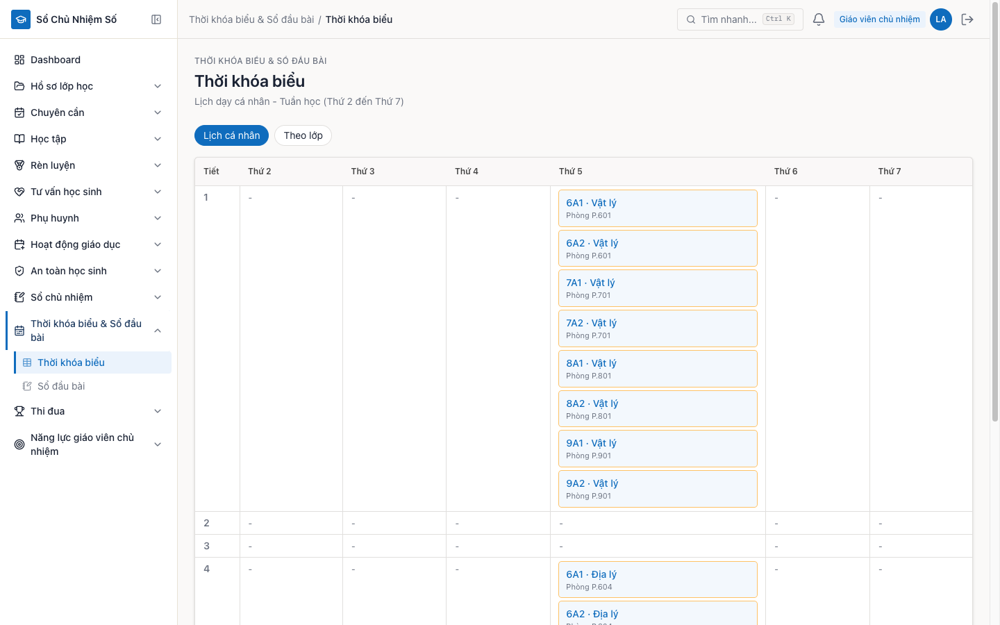
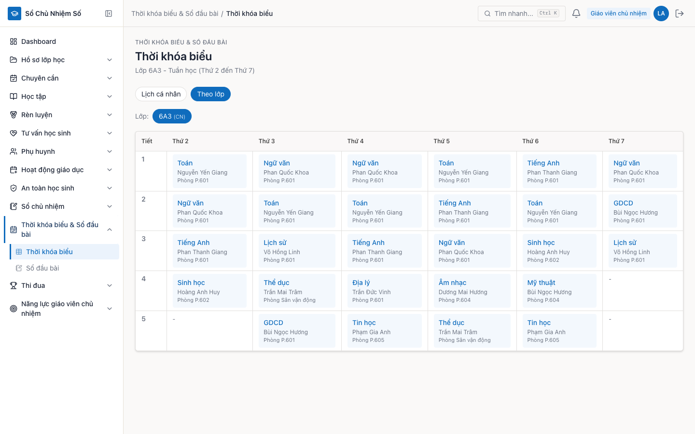

### 2.6 Sổ đầu bài

Menu **Thời khóa biểu & Sổ đầu bài → Sổ đầu bài**. Chọn ngày → danh sách tiết trong ngày hiện dạng thu gọn (tiết, môn, lớp, GV, sĩ số, chip vắng/muộn, trạng thái đã ghi).

Bấm vào tiết để mở form ghi:

1. **Sĩ số có mặt** - tự tính từ đánh dấu vắng/muộn.
2. **Tên bài học** - VD: "Bài 12 - Phép nhân phân số".
3. **Nội dung bài học** - nội dung đã dạy, bài tập giao.
4. **Nhận xét của giáo viên** - nhận xét lớp, cá nhân.
5. Đánh dấu từng em: vắng có phép / vắng không phép / đi muộn.
6. **+/− điểm rèn luyện**: nút +/− cạnh tên em → ghi khen thưởng/vi phạm kèm điểm vào sổ rèn luyện.
7. **Lưu** - hệ thống đồng bộ trạng thái vắng/muộn sang điểm danh ngày.

Nút **AI tóm tắt sổ đầu bài / Tóm tắt tuần** phân tích toàn bộ tiết đã ghi trong tuần.

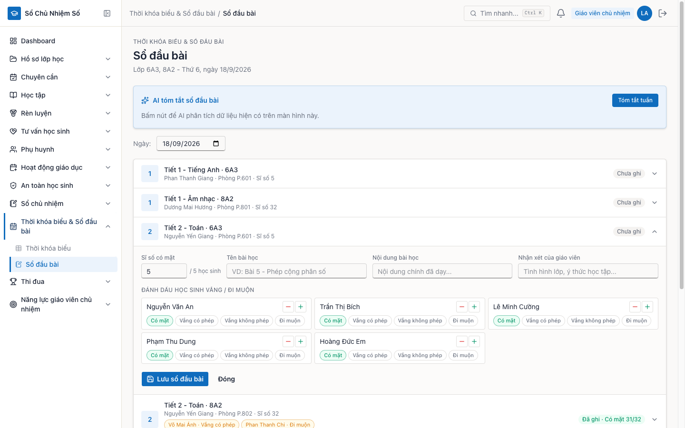

### 2.7 Sơ đồ lớp & danh sách học sinh

Menu **Sổ chủ nhiệm**:

- **Sơ đồ lớp**: kéo-thả học sinh vào ô ghế. **+ Hàng / − Hàng** và **+ Cột / − Cột** để đổi kích thước lưới (vị trí HS được giữ). **Lưu sơ đồ** tạo phiên bản mới - xem lại ở "Lịch sử phiên bản sơ đồ".
- **Danh sách HS & Tổ**: **Thêm tổ** → **Chia đều tổ** tự động xếp em vào các tổ; gán Ban cán sự bằng dropdown trên từng dòng; khu vực **Liên kết phụ huynh** để tạo tài khoản PH gắn với HS.

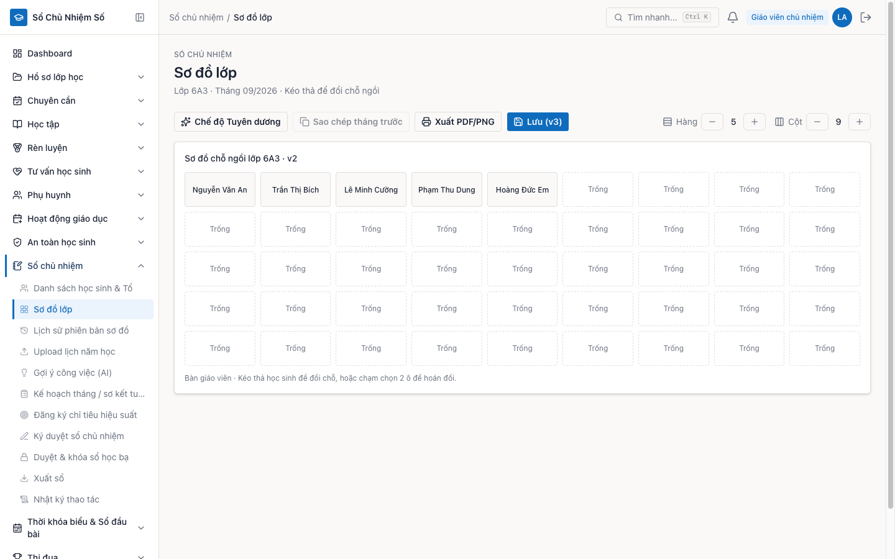
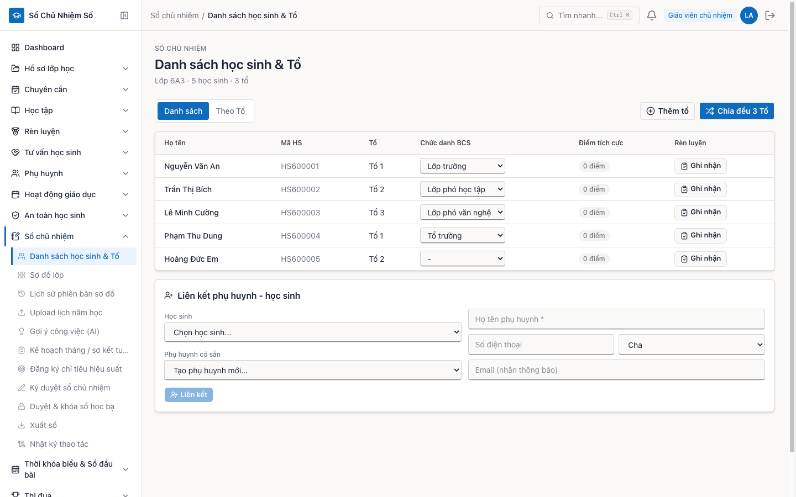

### 2.8 Rèn luyện

Menu **Rèn luyện → Nhận xét & vi phạm/khen thưởng**: chọn HS, loại (Nhận xét / Khen thưởng / Vi phạm), ngày, điểm (+/−), nội dung → **Ghi nhận**. Menu **Đánh giá & xếp loại** để xếp loại hạnh kiểm học kỳ cho cả lớp.

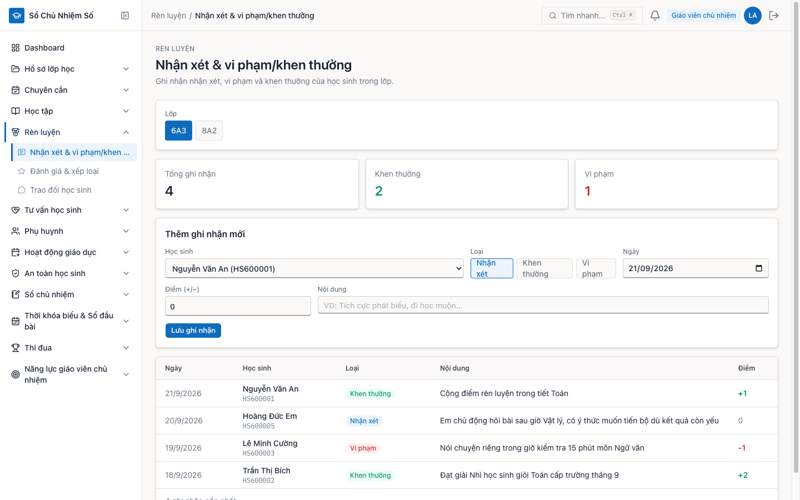

### 2.9 Liên lạc phụ huynh

- **Soạn & gửi thông báo**: chọn phạm vi (cả lớp / PH từng em), nhập tiêu đề + nội dung → gửi. PH nhận trong app + email.
- **Hộp thư phản hồi**: đọc/trả lời tin nhắn PH.
- **Lịch hẹn trao đổi**: xác nhận/từ chối lịch PH đề xuất.
- **Ban đại diện CMHS**: thêm thành viên + vai trò (Trưởng/Phó ban/Ủy viên).

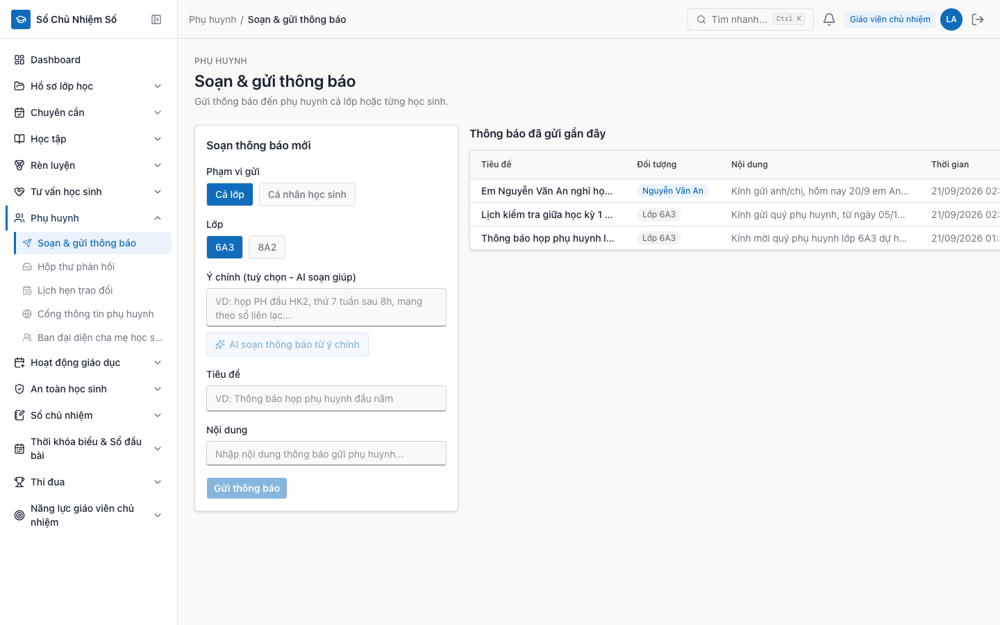

### 2.10 Tư vấn học sinh & an toàn

- **Tư vấn**: Tiếp nhận ca → Đánh giá mức độ (có AI gợi ý) → ca mức Cao chuyển tuyến chuyên gia.
- **An toàn**: Ghi nhận sự cố (loại + mức độ, AI viết lại mô tả) → theo dõi xử lý → lưu trữ.

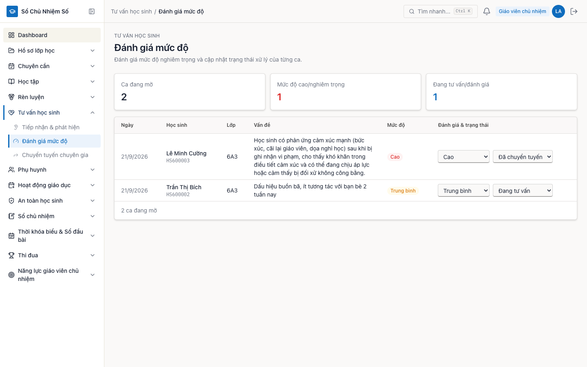
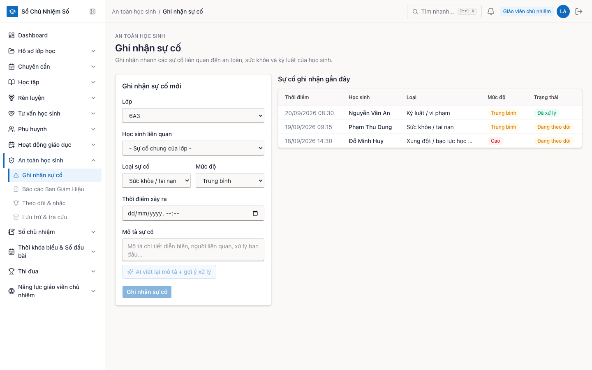

### 2.11 Kỳ thi, thi đua, kế hoạch, xuất sổ

- **Quản lý kỳ thi**: tạo kỳ thi → thêm buổi thi (thủ công/Import Excel) → công bố. Panel **AI sinh câu hỏi** theo 4 mức nhận thức.
- **Thi đua**: chấm điểm tiêu chí lớp mình; xem bảng xếp hạng toàn trường.
- **Kế hoạch tháng / sơ kết tuần**: checklist + nút **AI gợi ý công việc** đọc lịch năm học đề xuất việc.
- **Xuất sổ**: tải CSV toàn bộ dữ liệu sổ chủ nhiệm.

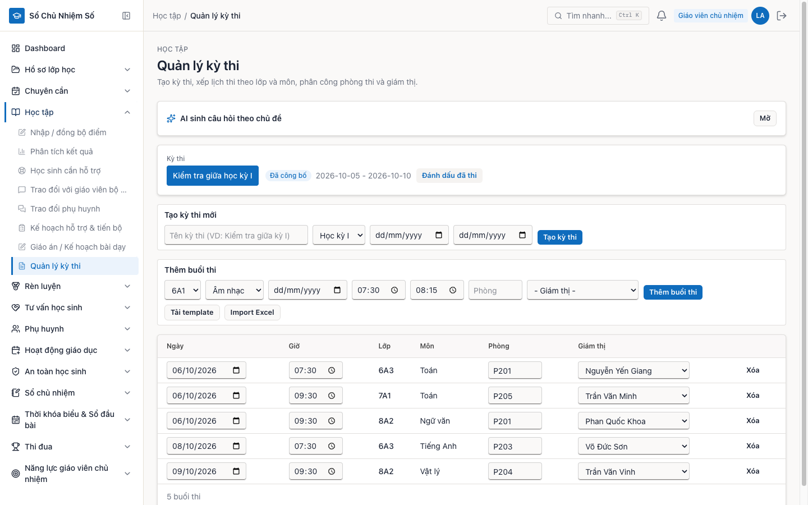
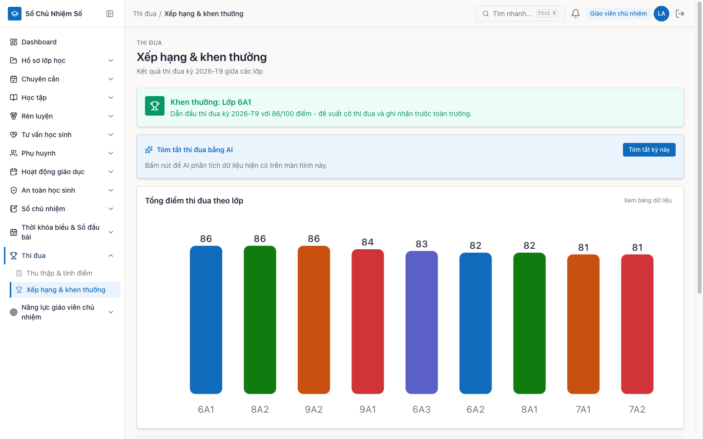
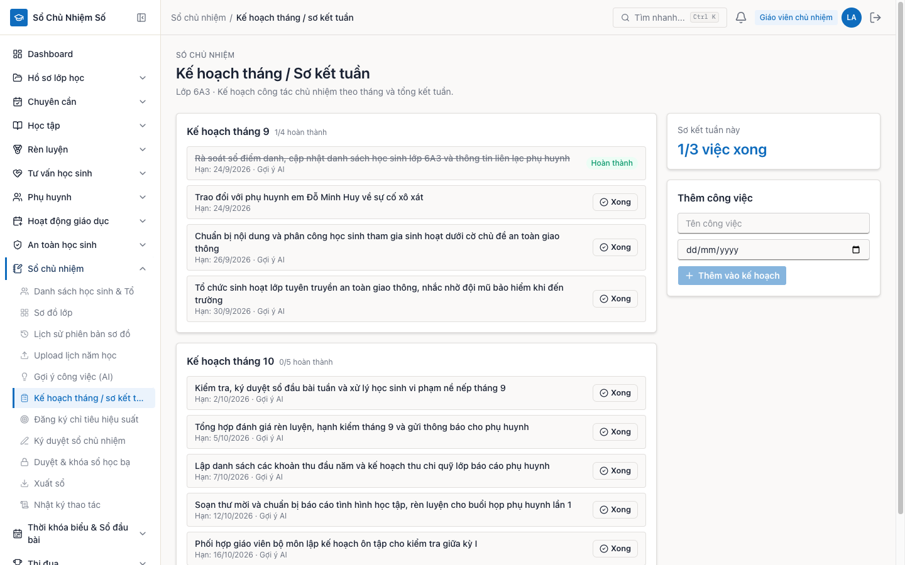
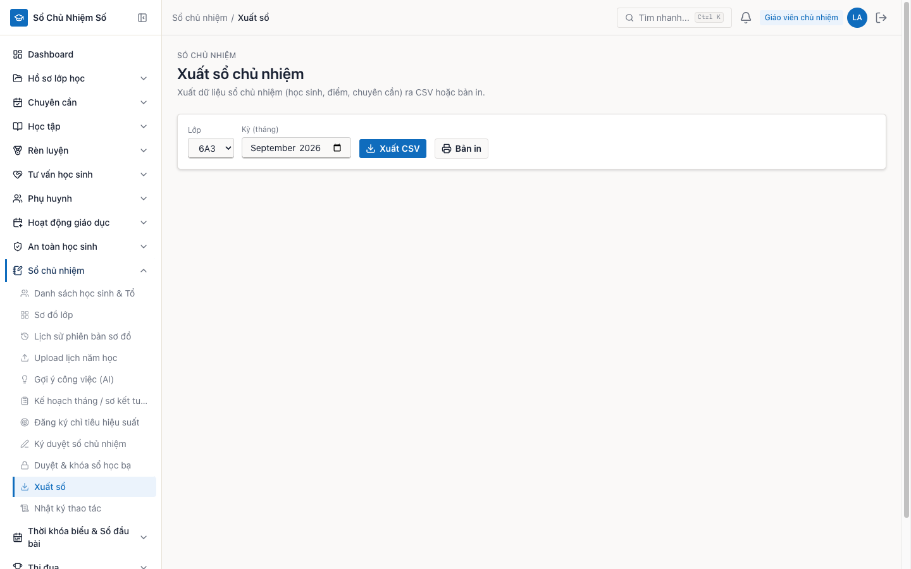

---

## 3. Giáo viên bộ môn (GVBM)

- **Lịch cá nhân**: vào Thời khóa biểu mặc định hiện toàn bộ tiết mình dạy (xem mục 2.5).
- **Sổ điểm**: nhập điểm các lớp mình dạy - thao tác như mục 2.4.
- **Sổ đầu bài**: ghi tiết mình dạy - thao tác như mục 2.6.
- **Giáo án**: soạn → nộp tổ trưởng; nếu bị trả về thì sửa theo nhận xét rồi nộp lại.
- **Trao đổi với GVCN**: chat gắn học sinh cụ thể.
- **Lịch thi**: xem lịch coi thi/thi của lớp mình dạy.

---

## 4. Tổ trưởng chuyên môn

- **Duyệt giáo án**: danh sách giáo án GV trong tổ nộp → xem nội dung → **AI gợi ý nhận xét** → Duyệt hoặc Trả về kèm nhận xét.
- **Duyệt đánh giá năng lực**: xét đánh giá tự chấm của GV trong tổ.
- **Sinh hoạt chuyên môn**: tạo buổi sinh hoạt (chủ đề, ngày, ghi chú) → **AI soạn biên bản** từ ghi chú nhanh.
- **Danh sách giáo viên**: xem GV trong tổ, môn dạy.

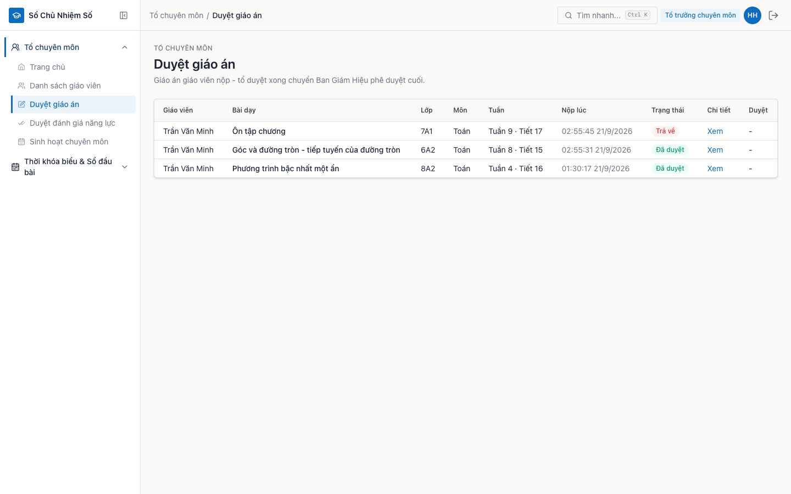
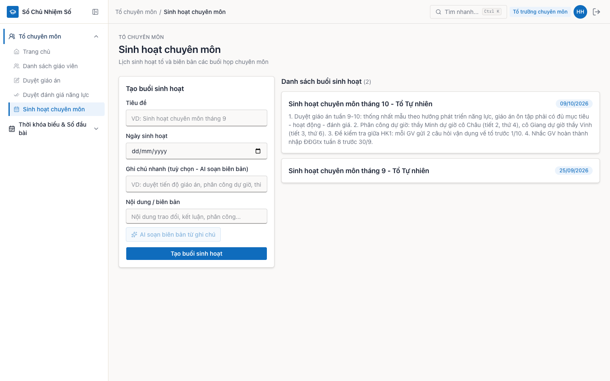

---

## 5. Ban Giám Hiệu (BGH) / Phó Hiệu trưởng (PHT)

PHT có chức năng tương tự BGH nhưng chỉ trong phạm vi cơ sở/phân hiệu phụ trách.

- **Dashboard cấp trường**: chuyên cần, điểm, sự cố, cảnh báo toàn trường.
- **Trung tâm phê duyệt**: duyệt kế hoạch hoạt động giáo dục và các đơn chờ.
- **Báo cáo ngày các lớp**: xem báo cáo GVCN đã gửi.
- **Radar cảnh báo sớm**: danh sách cảnh báo theo mức → **AI đề xuất** can thiệp → Tiếp nhận → Đóng cảnh báo.
- **Trợ lý điều hành (AI)**: chat hỏi đáp trên số liệu thật của trường.
- **Thời khóa biểu**: xem mọi lớp + **Tải template / Import Excel** để xếp TKB hàng loạt (định dạng ô `Môn|GV|Phòng`).
- **Điều động dạy thay**, **Nhân sự**, **Phân công năm học**, **Đánh giá TT15**, **Ký duyệt sổ chủ nhiệm**, **Duyệt & khóa sổ học bạ**, **Sự cố toàn trường** (đánh dấu đã báo cáo).

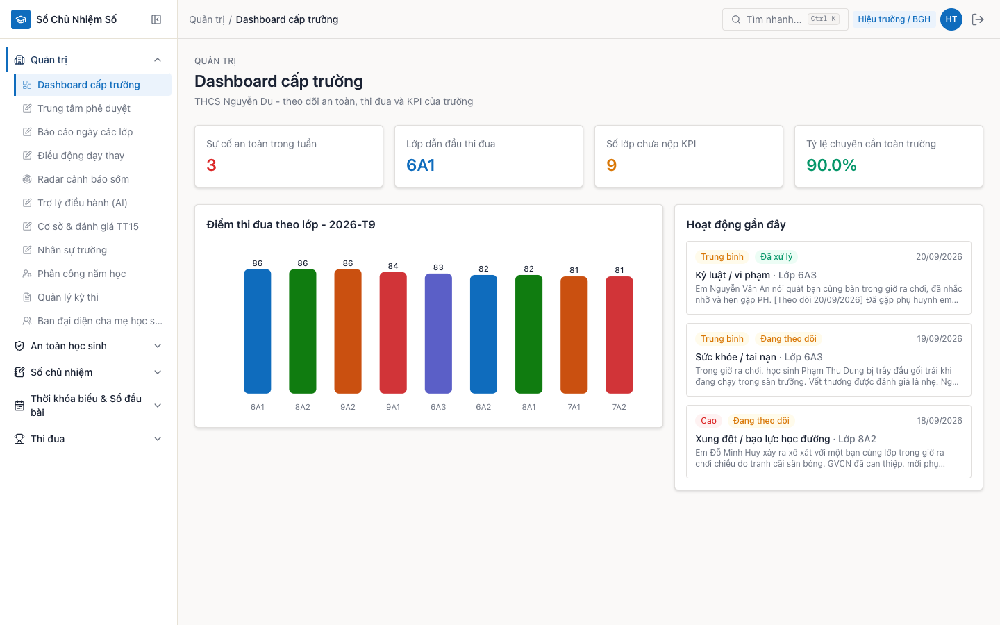
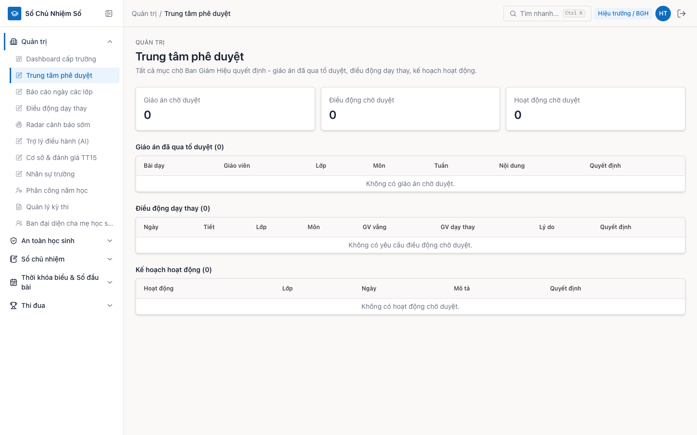
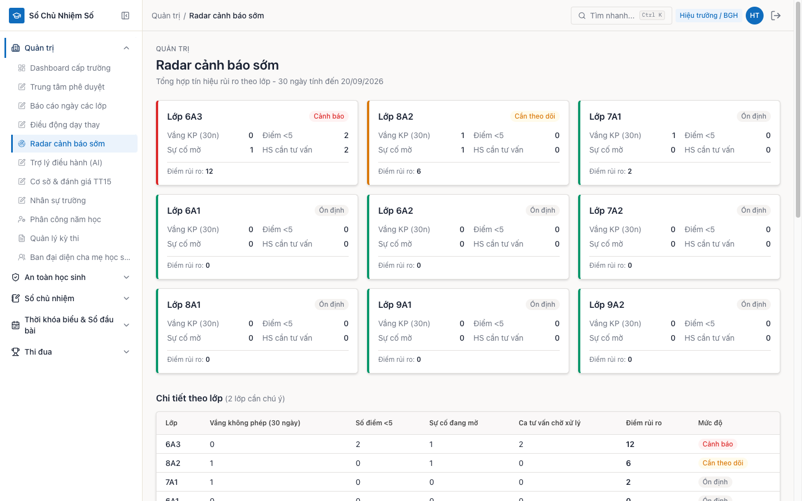
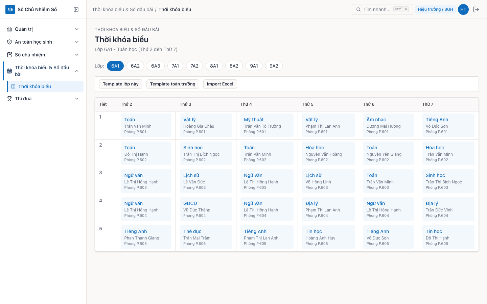
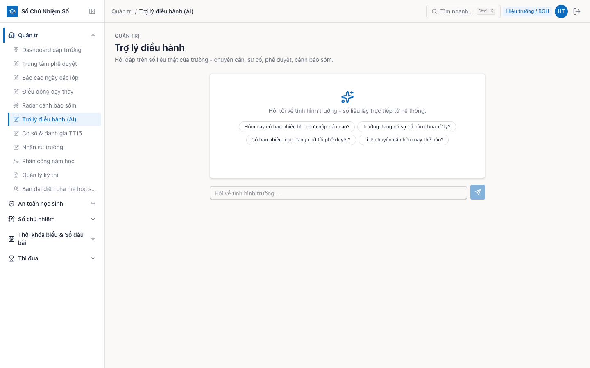

---

## 6. Sở GD&ĐT / Phòng GD&ĐT / UBND

- **Dashboard cấp Sở/Phòng/địa bàn**: tổng hợp các trường - quy mô, tỷ lệ chuyên cần, sự cố, cảnh báo; nút **AI bản tin** tổng hợp.
- **Quản trị người dùng** (Sở): tài khoản các trường.
- **Quản trị dữ liệu** (Sở): kiểm tra toàn vẹn - lớp thiếu GVCN, HS chưa có tổ/phụ huynh, liên kết mồ côi.

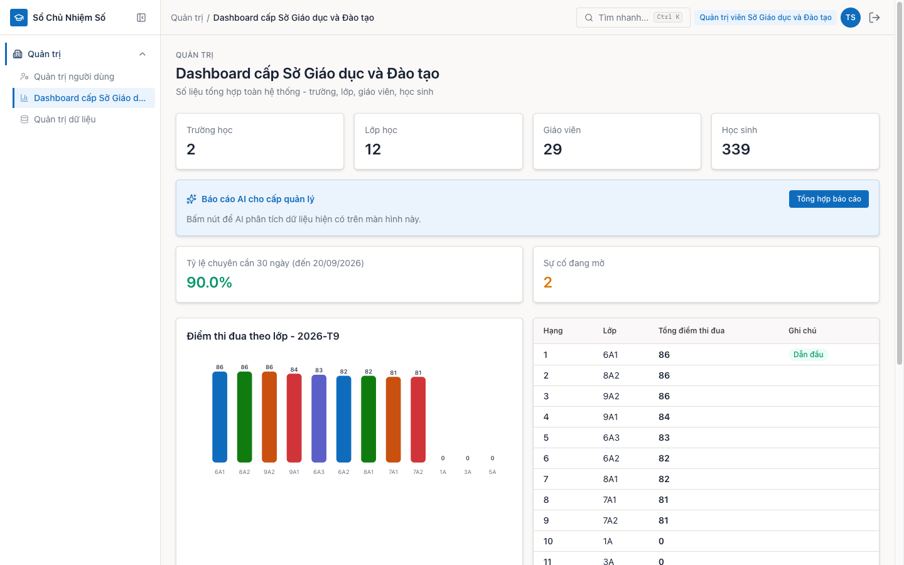
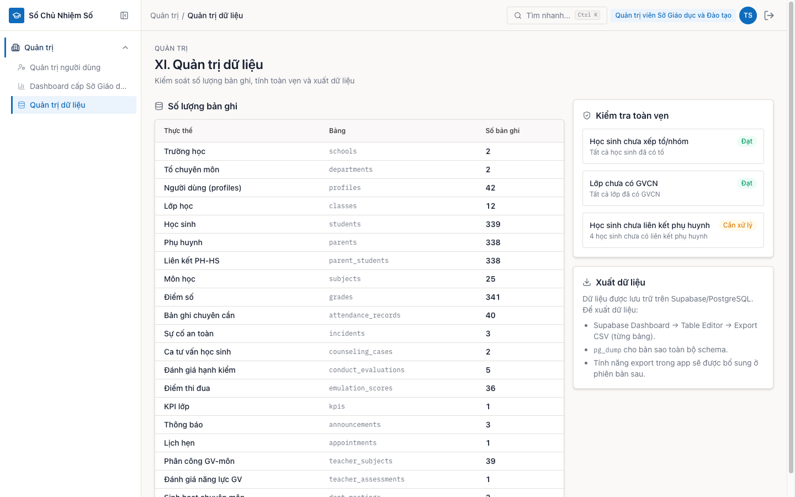

---

## 7. Phụ huynh

Portal phụ huynh hiển thị thông tin con mình (hai PH cùng con thấy chung dữ liệu):

- **Thông báo lớp**: đọc thông báo GVCN gửi.
- **Tin nhắn**: trả lời tin nhắn GVCN trực tiếp.
- **Đặt lịch hẹn**: chọn ngày giờ + hình thức + lý do → chờ GVCN xác nhận → trạng thái chuyển "Đã xác nhận".
- **Đăng ký hoạt động**: các hoạt động giáo dục đã công bố → bấm **Đăng ký** cho con.
- **Thông tin con**: điểm số, chuyên cần, hạnh kiểm.

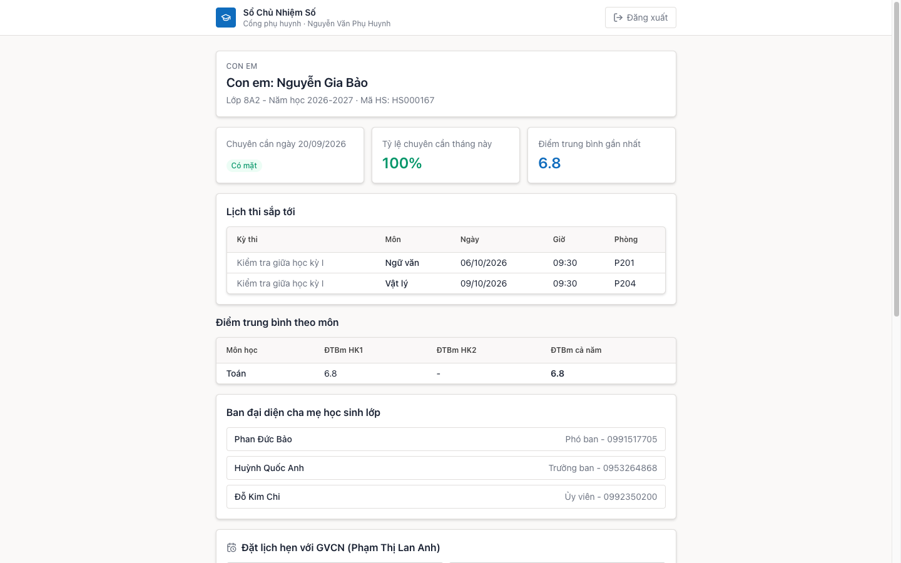

---

## 8. Học sinh

Portal học sinh xem dữ liệu bản thân: thời khóa biểu, điểm các môn, hạnh kiểm, thông báo lớp, lịch thi.

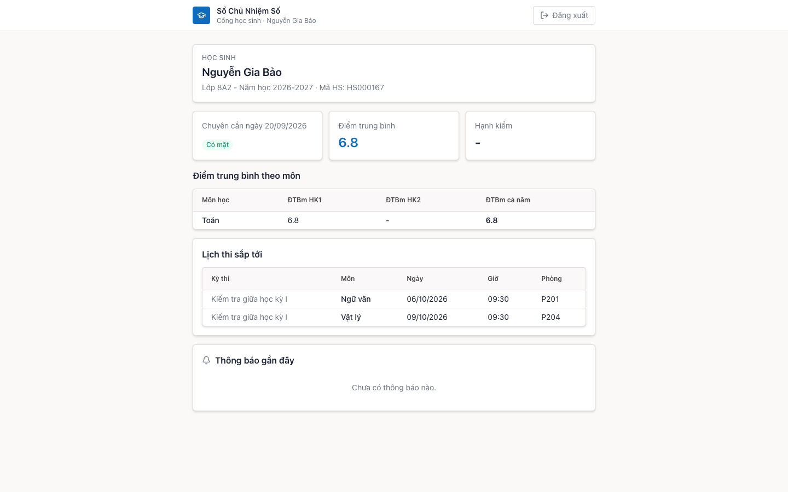

---

## 9. Mẹo sử dụng

- **Tìm nhanh**: Ctrl+K mở command palette - gõ tên chức năng/học sinh để nhảy thẳng tới.
- **Ngày/khoảng ngày**: các màn hình chuyên cần đều có chọn ngày hoặc khoảng ngày; đổi giá trị rồi dữ liệu tự cập nhật theo URL (có thể lưu bookmark link kèm ngày).
- **Import Excel**: mọi màn hình có Import đều có nút **Tải template** - luôn tải template mới nhất trước khi import.
- **AI**: các nút AI (tóm tắt, gợi ý, viết lại, sinh câu hỏi) chạy trên dữ liệu thật đang hiển thị; nếu AI bận, hệ thống tự dùng phương án dự phòng.
- **Điện thoại**: giao diện responsive - menu thu vào biểu tượng ☰, bảng cuộn ngang, tên học sinh vẫn hiển thị đầy đủ.
